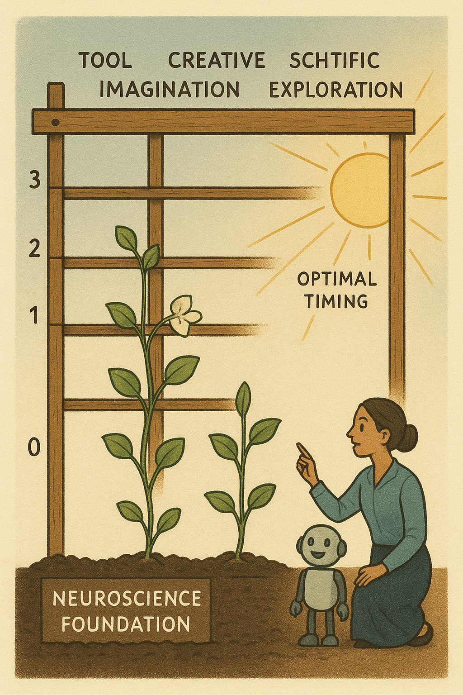
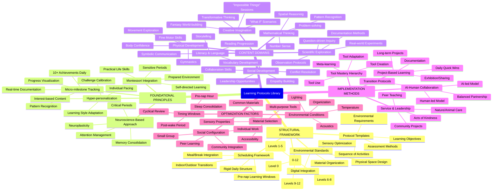
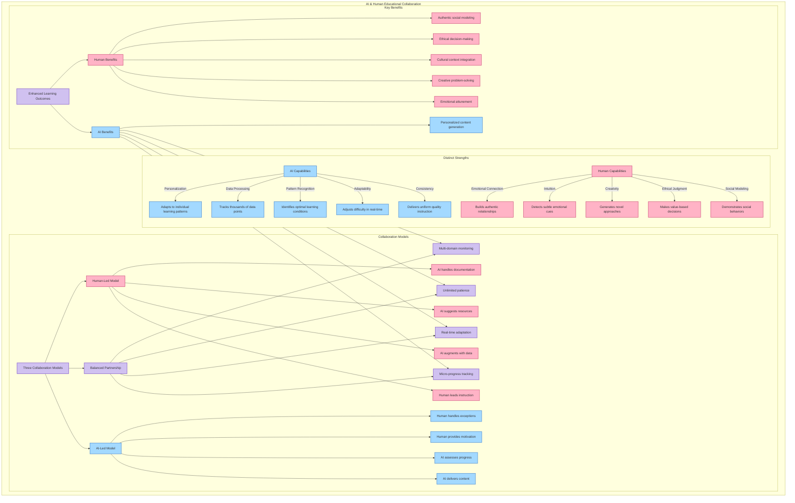

# Learning Protocols Library

## Vision

A comprehensive repository of learning protocols designed for young children, including those who have not yet learned to read. This library serves as a blueprint for educational experiences that combine AI tutoring with human teacher facilitation across all subjects and developmental domains.

Our approach can be visualized as a trellis structure—a sturdy framework that provides support while allowing for natural, organic growth. Learning protocols form the structured lattice, while children's development represents the growing plants that climb and flourish with proper support.

## Core Goals

- Create structured learning experiences for early childhood development
- Focus initially on foundational skills like alphabet and counting
- Incorporate Montessori curriculum best practices
- Optimize learning through environmental factors and timing
- Track development at a micro-level (10+ measurable achievements daily)
- Provide hyper-personalized learning progression
- Build on neuroscience research for optimal learning strategies
- Develop mastery in tool use and adaptability to new tools
- Integrate social development and leadership as core competencies

## Project Overview

## Key Considerations

### Neuroscience-Based Approach
- Use Andrew Huberman's research on neuroscience and learning as foundation
- Incorporate primary research papers on neuroplasticity and learning windows
- Apply evidence-based protocols for attention, focus, and memory consolidation
- Leverage understanding of neurochemical states for optimal learning conditions

### Consistent Scheduling
- Implement rigid, immutable daily structures for beginning/middle/end of day
- Maintain strict consistency for meals, breaks, and nap times
- Establish unwavering indoor/outdoor transitions with exceptions only for extreme weather
- Create predictable rhythms that support neurological development and security

### Optimal Timing
- Leverage the pre-nap hour as a critical learning window
- Structure learning activities based on children's natural cognitive rhythms
- Document and utilize time-of-day impact on learning and retention

### Environmental Optimization
- Define specific environmental requirements for each learning protocol
- Consider physical space, available tools, and social context
- Create consistent environmental conditions for optimal learning
- Use widely available, common materials and classroom supplies

### Tool Mastery Hierarchy
- Prioritize the meta-skill of learning how to use new tools
- Expose children to diverse tool types: physical, cognitive, social, emotional
- Progress from tool use to tool adaptation to tool creation
- Emphasize regular introduction of new tools to develop adaptability
- Include fundamental human tools: language, expression, negotiation, collaboration
- Balance specific tool mastery with flexibility to approach new tools

### Social Development
- Integrate leadership opportunities immediately upon competency establishment
- Balance confidence with accurate self-assessment
- Develop comfort in public social settings
- Practice structured interactions that build genuine competence
- Incorporate acts of kindness and generosity as fundamental social tools
- Build social skills through progressive responsibility and peer teaching

### Personalization
- Develop elastic learning protocols that advance at the student's pace
- Design for diverse learning needs at a meta-framework level
- Build in flexibility for hyper-personalized experiences
- Only advance curriculum topics at the individual student's rate of mastery

### AI and Human Collaboration
- Utilize both AI and human facilitators without artificial constraints
- Define clear collaboration models and handoff procedures
- Maintain focus on relationship-based learning

## AI-Human Collaboration Model

### Progress Tracking
- Implement micro-milestone tracking (like video game levels)
- Create systems to document multiple achievements daily
- Develop comprehensive assessment frameworks

## Implementation Philosophy

This repository will be structured to support learning that is:

- Developmentally appropriate
- Research-based with direct ties to neuroscience
- Multi-sensory and experiential
- Relationship-centered
- Playful and engaging
- Precisely measured
- Consistently structured
- Socially integrated
- Tool-focused with emphasis on adaptability
- Balanced between mastery and exploration

## Practical Implementation

- Use common, easily available materials and supplies accessible online
- Create environments that can be replicated with minimal specialized equipment
- Provide specific product recommendations where needed
- Balance ideal materials with accessible alternatives
- Focus on protocols that scale from individual to small group settings

## Future Development

This library will eventually expand to cover:
- All subjects and disciplines
- All areas of human development
- Multiple age ranges and developmental stages
- Advanced tool creation and innovation
- Community leadership and social impact